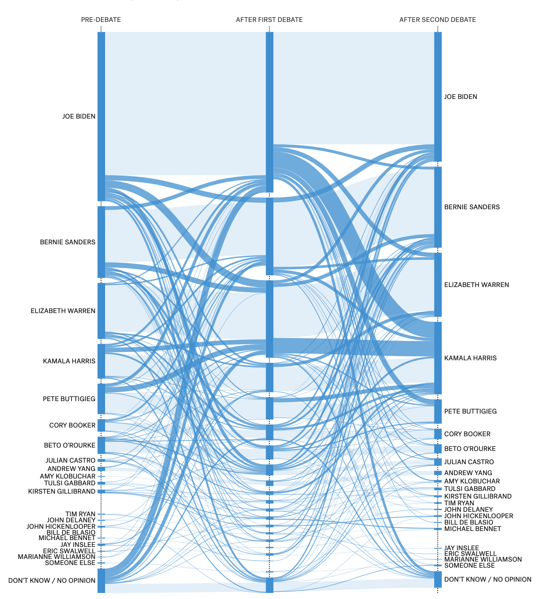

```{r setup, include=FALSE}
# create image folder ----
if (!file.exists("figs/")) {
    dir.create("figs/")
}
# create data folder ----
if (!file.exists("data/")) {
    dir.create("data/")
}
knitr::opts_chunk$set(
    echo = TRUE, # show all code
    tidy = FALSE, # cleaner code printing
    size = "small",
    fig.path = "figs/") # smaller code
knitr::opts_knit$set(
    width = 78)
base::options(tibble.print_max = 25,
              tibble.width = 78)
library(tidyverse)
library(Hmisc)
library(janitor)
library(magrittr)
library(rtweet)
```

# Motivation

We've want see how popular each democratic candidate did after the first round of [2019 Democratic Presidential Debates](https://en.wikipedia.org/wiki/2020_Democratic_Party_presidential_debates_and_forums), but we missed all the coverage.

We happened to read an article from the data journalism website [`fivethirtyeight`](https://projects.fivethirtyeight.com/democratic-debate-poll/), and it displayed an image showing how voters had changed their minds after seeing the candidates. 

```{r 03-538-night-one-debates.png, echo=FALSE}

```

This document outlines the data import, wrangling, and visulizations used in this project. 

```{r project-files}
fs::dir_tree(".", recurse = FALSE)    
```


## Data sources 

These data come from two sources, Wikipedia and Google trends. We will start be collecting the data from Wikipedia on the debate.

```{r 01-import, message=FALSE, warning=FALSE}
source("code/01-import.R")
```

## The democratic candidates 

There were ten candidates in the first night of debates, and all are listed alphabetically below. 

```{r dem_cand_2020}
dem_candidates <- c("Amy Klobuchar",
                "Beto O’Rourke",
                "Bill de Blasio",
                "Cory Booker",
                "Elizabeth Warren",
                "Jay Inslee",
                "John Delaney",
                "Julián Castro",
                "Tim Ryan",
                "Tulsi Gabbard")
base::writeLines(dem_candidates)
```

### The Wikipedia table

[Wikipedia page on 2020 democratic debates (first night)](https://en.wikipedia.org/wiki/2020_Democratic_Party_presidential_debates_and_forums#Summary). 

The data, `WikiDemAirTime01Raw` are in the work session below. 

```{r WikiDemAirTime01}
WikiDemAirTime01Raw %>% head(10)
WikiDemAirTime02Raw %>% head(10)
```


### Google trends data

We are interested in collecting data from June 25, 2019 until June 27, 2019 to get a gauge of how well (or how bad) each candidate did in terms of gaining interest (as measured by Google search trends). The Google search trends are accessible via the [gtrendsR](https://github.com/PMassicotte/gtrendsR) package. This and other packages are in the `00-packages.R` script. 

### Google search terms 

Each candidates name was searched for with "2020". We thought it would be a good idea to add "2020" to the candidates name to make it easier to identify searches that corresponded to the interested with the upcoming election. 

## Twitter data 

The twitter data for the first night of candidates are below. These data were collected ~1 week after the debates. 

```{r ts_plot}
TwitterData %>%
  ts_plot("3 hours") +
  ggplot2::theme_minimal() +
  ggplot2::theme(plot.title = 
                   ggplot2::element_text(face = "bold")) 
```

## Wrangle data

See the script for more details.

```{r wrangle, eval=TRUE, message=FALSE, warning=FALSE}
source("code/02-wrangle.R")
```

## Exploratory Data Analysis 

Start with visualizing as much of the data as possible. These two graphs tell us 1) "what kind of variables are in the data set?" and 2) "how much are missing?"

```{r visdat-inspectdf}
library(visdat)
library(inspectdf)
inspectdf::inspect_types(Dems2020Debate01IOTAirTime) %>% 
  inspectdf::show_plot()
visdat::vis_miss(Dems2020Debate01IOTAirTime) + 
  ggplot2::coord_flip()
```

### Candidates with high % going into debates

[fivethirtyeight](https://projects.fivethirtyeight.com/democratic-debate-poll/) did a pre-debate survey with MorningConsult and asked who voters were most likely to vote for before each debate, then asked them who they would vote for *after the debate*, this .

> *To track which candidates are winning over voters, we asked respondents who they would vote for before and after each debate. That lets us measure not only who gained (or lost) support, but also where that support came from (or went to).*

When we look at the candidates with the highest percent of likely voters on the 26th, we see the following:

```{r top-3-candidates}
Dems2020Debate01IOTAirTime %>% 
  dplyr::filter(prior_vperc_fct == "> 1.0% of voters") %>% 
  ggplot(aes(x = date, 
             y = hits, 
             color = keyword)) +
  geom_line(aes(group = keyword), show.legend = FALSE) + 
  ggplot2::labs(
    x = "Date",
    y = "Google search hits",
    caption = paste0("Google search hits between ", 
                   min(Dems2020Debate01IOTAirTime$date),
                   " and ",
                   max(Dems2020Debate01IOTAirTime$date)),
    subtitle = "Google search hits for Candidates with > 1.0% of voters") + 
  ggthemes::theme_fivethirtyeight(base_size = 9) +
  facet_wrap(~ keyword, ncol = 2)
```

This shows Booker doing well, Warren getting some searches later in the evening, etc. But we should narrow this down to the 7 day we're interested in (23rd - 29th) and store it in `Dems2020IOTAirTime7day`.

```{r Dems2020IOTAirTime7day}
Dems2020IOTAirTime7day <- Dems2020Debate01IOTAirTime %>% 
                                   dplyr::filter(date >= "2019-06-22" & 
                                                 date < "2019-06-30")
```

If we narrow this down to the week of the debates, we see the following:

```{r 7-day-top-3}
Dems2020IOTAirTime7day %>% 
  dplyr::filter(prior_vperc_fct == "> 1.0% of voters") %>% 
  ggplot(aes(x = date, 
             y = hits, 
             color = keyword)) +
  geom_line(aes(group = keyword), show.legend = FALSE) + 
  ggplot2::labs(
    x = "Date",
    y = "Google search hits",
    subtitle = "Google search hits for Candidates with > 1.0% of voters") + 
  ggthemes::theme_fivethirtyeight(base_size = 8) +
  facet_wrap(~ keyword, ncol = 2)
```

Now we can see Booker is definitely ahead of Warren in terms of hits over time.

```{r google-middle-percent-candidates}
Dems2020IOTAirTime7day %>% 
  dplyr::filter(prior_vperc_fct == "0.5 - 0.9% of voters") %>% 
  ggplot(aes(x = date, 
             y = hits, 
             color = keyword)) +
  geom_line(aes(group = keyword), show.legend = FALSE) + 
  ggplot2::labs(
    x = "Date",
    y = "Google search hits",
    caption = paste0("Google search hits between ", 
                   min(Dems2020Debate01IOT$date),
                   " and ",
                   max(Dems2020Debate01IOT$date)),
    subtitle = "Google Search Hits for Candidates with between 0.5 - 0.9% of voters") + 
  ggthemes::theme_fivethirtyeight(base_size = 9) +
  facet_wrap(~ keyword, ncol = 2)
```


```{r google-low-candidates, message=FALSE, warning=FALSE}
Dems2020IOTAirTime7day %>% 
  dplyr::filter(prior_vperc_fct == "0.2 - 0.4% of voters") %>% 
  ggplot(aes(x = date, 
             y = hits, 
             color = keyword)) +
  geom_line(aes(group = keyword), show.legend = FALSE) + 
  ggplot2::labs(
    x = "Date",
    y = "Google search hits",
    subtitle = "Google search hits for candidates with between 0.2 - 0.4% of voters",
    caption = paste0("0.2 - 0.4% of voters ",
                     min(Dems2020Debate01IOT$date),
                   " and ",
                   max(Dems2020Debate01IOT$date))) + 
  ggthemes::theme_fivethirtyeight(base_size = 7.5) +
  facet_wrap(~ keyword, ncol = 3)
```

This looks like Gabbard had a better night than the other three candidates in her group.

### Candidates who had to gain ground in the debates

This is the middle group of candidates who would need to grab one of the top-ranking spots. 

```{r google-bottom-percent-candidate}
Dems2020IOTAirTime7day %>%  
  dplyr::filter(prior_vperc_fct == "0.2% of voters") %>% 
  ggplot(aes(x = date, 
             y = hits, 
             color = keyword)) +
  geom_line(aes(group = keyword), show.legend = FALSE) + 
  ggplot2::labs(
    x = "Date",
    y = "Google search hits",
    subtitle = paste0("Google search hits between ", 
                   min(Dems2020Debate01IOT$date),
                   " and ",
                   max(Dems2020Debate01IOT$date)),
    caption = "using RStudio and gtrendsR") + 
  ggthemes::theme_fivethirtyeight() +
  facet_wrap(~ keyword, ncol = 3)
```

For coming in with the lowest polling percentage (based on voting that day), John Delaney ended up with a moderate boost in Google searches. 


### Women candidates

We can also check the `gender` categorical variable to see how the candidates break down across `Men` and `Women`

```{r Dems2020Debate01IOT-date-hits-women}
Dems2020IOTAirTime7day %>% 
  dplyr::filter(gender == "Women") %>% 
  ggplot(aes(x = date, 
             y = hits, 
             color = keyword)) +
  geom_line(aes(group = keyword)) + 
  ggplot2::labs(
    x = "Date",
    y = "Google search hits",
    subtitle = paste0("Google search trends between ", 
                   min(Dems2020Debate01IOT$date),
                   " and ",
                   max(Dems2020Debate01IOT$date)),
    caption = "using RStudio and gtrendsR") + 
  ggthemes::theme_fivethirtyeight(base_size = 8) + 
  facet_wrap(. ~ keyword)
```

This shows Gubbard outperforming Warren in Google searches. And the `Men`...

```{r Dems2020Debate01IOT-date-hits-men}
Dems2020IOTAirTime7day %>% 
  dplyr::filter(gender == "Men") %>% 
  ggplot(aes(x = date, 
             y = hits, 
             color = keyword)) +
  geom_line(aes(group = keyword)) + 
  ggplot2::labs(
    x = "Date",
    y = "Google search hits",
    subtitle = paste0("Google search trends between ", 
                   min(Dems2020Debate01IOT$date),
                   " and ",
                   max(Dems2020Debate01IOT$date)),
    caption = "using RStudio and gtrendsR") + 
  ggthemes::theme_fivethirtyeight(base_size = 7.5) + 
  facet_wrap(. ~ keyword, ncol = 3)
```

Shows Cory Booker doing the best, followed by John Delany. 

### Map the data by state

What does the interest look like by location (i.e. `"region"`)? 

We've created a new data structure `Dems2020InterestByRegion`. What does it look like?

```{r Dems2020InterestByRegion}
# recheck the structure
Dems2020InterestByRegion %>%
  skimr::skim_to_wide() %>% 
  dplyr::filter(type %in% c("integer", "numeric")) %>% 
  dplyr::select(variable, 
                n, 
                mean, 
                sd, 
                median = p50, 
                hist)
```


It looks like the variable of interest (`hits`) is pretty lopsided--what can we do about it? After googling, we discover [this article](https://medium.com/@TheDataGyan/day-8-data-transformation-skewness-normalization-and-much-more-4c144d370e55) with this information, 

> "The logarithm, x to log base 10 of x, or x to log base e of x (ln x), or x to log base 2 of x, is a strong transformation and can be used to reduce right skewness."

Now we've documented our thought process (the "why"), and can log-transform the data in the next graph. 

## Tulsi Gabbard 2020 searches

```{r visualize-Gabbard-locations}
Dems2020InterestByRegion %>% 
  dplyr::filter(keyword %in% "Tulsi Gabbard 2020") %>% 
  ggplot(aes(x = long, 
             y = lat)) +
  geom_polygon(aes(group = group,
                   # get the log(hits)
                   fill = log(hits)), 
                   color = "white") + 
  ggthemes::theme_map() + 
  ggplot2::labs(
    title = "Google searches for Tulsi Gabbard in 2020 on June 26, 2019",
    subtitle = "lighter colors = more searches for 'Tulsi Gabbard 2020'",
    caption = "using RStudio and gtrendsR") 
```

## Cory Booker 2020 searches

These are the searches for Cory Booker on states. 

```{r visualize-Booker-locations}
Dems2020InterestByRegion %>% 
  dplyr::filter(keyword == "Cory Booker 2020") %>% 
  ggplot(aes(x = long, 
             y = lat)) +
  geom_polygon(aes(group = group,
                   # get the log(hits)
                   fill = log(hits)), 
                   color = "white") + 
  ggthemes::theme_map() + 
  ggplot2::labs(
    title = "Google searches for Cory Booker in 2020 on June 26, 2019",
    subtitle = "lighter colors = more searches for 'Cory Booker 2020'",
    caption = "using RStudio and gtrendsR")
```


## Sharing your work

Click `knit` to get the markdown file to share.


## Ask more questions

What other questions can we answer with these data?


